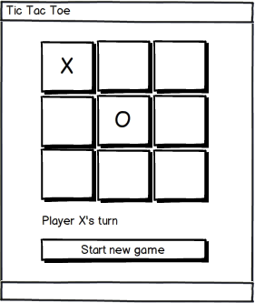

# Requirements analysis
The requirements analysis tries to find increments which make sense to the customer/user as well as to the developer.

## Applications (-> sln)
The requirements clearly state the solution should consist of a single desktop application.

## Partitions (-> prj)
The scope of the application seems to be small enough to not be split across multiple partitions.

## Dialogs (-> class)
So far only one dialog seems to be needed. It shows the game board, allows players to draw, displays status messages, and provides a way to start a new game. It could look like this:

## Interactions (-> function)
Players interact with the dialog in several ways. They use different technical events as triggers for application behavior.

* They open the dialog on application startup; a new game is displayed
* They take turns drawing; the game board is updated after each draw
* They start a new game

Nothing special happens upon closing the dialog/ending the application.

## Features (-> function)
Interactions can be refined into features. Whereas interactions are cross-cuts through an application, features are "just" aspects of some kind within the scope of an interaction.

#### Startup
* Start new game.

#### Start new game
* Clear game board.
* Make X the current player.
* Inform users about current player.

#### Player draws
* Check if selected field is already occupied on game board.
* Place symbol for current player into selected field on game board.
* Check if the player wins.
* Check if the game is over.
* Switch current player.
* Inform users about the current situation (e.g. current player or win).