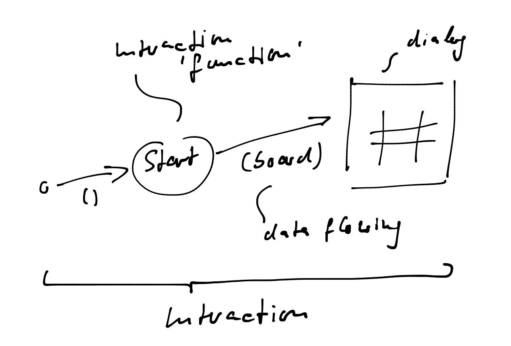

# Solution design
Solution design refines the findings from the analysis phase so that implementation becomes pretty straightforward.

Also solution design slices requirements so finely that feedback can be gathered quickly. For that to be possible it focuses on a single interaction or even feature.

# Increment #1
Starting the application seems a natural starting point for incremental development.

The following figure shows the start interaction refined into fundamental features:



Feature #1 is the dialog. Feature #2 is the functional unit representing the logic needed to produce the desired behavior.

The logic does not need any data to operate on. That's represented by the () on the data flow arrow pointingt to _Start_. But the logic delivers a _board_ to the dialog.

This _board_ contains the data to be displayed as a 2D matrix in a manner to make it most easy for the dialog to render it and still be flexible.

In order to determine the best data structure for _board_ thus the API behind the dialog needs to be taken into account. I choose it to be WinForms.

Since data binding is not that easy with WinForms, I guess a board could be an array of characters, e.g. _char[] board = new char[9]_ containing a ' ' or 'X' or 'O' for each field. Or it could be a string of a fixed length, e.g. "X   O   X ".

Or a board could be an array of enum values, e.g.

```
enum Fieldvalues {
 Empty,
 X,
 O
};

Fieldvalues[] board;
```

The char-based solution would leave more room for errors; a wrong char could end up in the array/string. So I go with the enum-based solution.

## Functions
The functions of the first increment can be derived from the above drawing:

```
class Interactions {
  public Board Start();
}

class Dialog {
  public void Display(Board board)
}
```

The classes they reside on are pretty obvious, I think. Also the additional data classes/types:

```
enum Fieldvalues {...} // see above

class Board {
  public Fieldvalues[] Fields;
}

```

This increment should only "prove" I can start the application and a board gets displayed. Since an empty board is not very exciting, I'll fill it with some random data; not much logic should be required for that.

