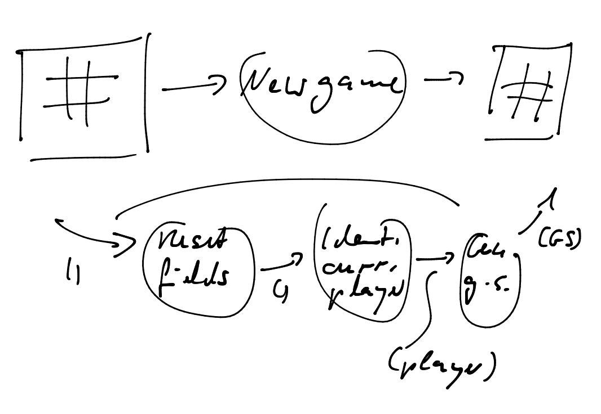

# Solution design
Solution design refines the findings from the analysis phase so that implementation becomes pretty straightforward.

Also solution design slices requirements so finely that feedback can be gathered quickly. For that to be possible it focuses on a single interaction or even feature.

# Increment #1
Starting the application seems a natural starting point for incremental development.

The following figure shows the start interaction refined into fundamental features:


Feature #1 is the dialog. Feature #2 is the functional unit representing the logic needed to produce the desired behavior.

The logic does not need any data to operate on. That's represented by the () on the data flow arrow pointingt to _Start_. But the logic delivers a _board_ to the dialog.

This _board_ contains the data to be displayed as a 2D matrix in a manner to make it most easy for the dialog to render it and still be flexible.

In order to determine the best data structure for _board_ thus the API behind the dialog needs to be taken into account. I choose it to be WinForms.

Since data binding is not that easy with WinForms, I guess a board could be an array of characters, e.g. _char[] board = new char[9]_ containing a ' ' or 'X' or 'O' for each field. Or it could be a string of a fixed length, e.g. "X   O   X ".

Or a board could be an array of enum values, e.g.

```
enum Fieldvalues {
 Empty,
 X,
 O
};

Fieldvalues[] board;
```

The char-based solution would leave more room for errors; a wrong char could end up in the array/string. So I go with the enum-based solution.

A 1D-array should be fine to pass into the dialog. It contains an element for each field indexed from 0..8. Fields are numbered from left top to right bottom in the dialog.

A 2D-array would be more specific for the current layout. But then it's also a tad more limiting the display. A 1D-array also makes it easier to address individual fields with just one index.

## Functions
The functions of the first increment can be derived from the above drawing:

```
class Interactions {
  public Board Start();
}

class Dialog {
  public void Display(Board board);
}
```

The classes they reside on are pretty obvious, I think. Also the additional data classes/types:

```
enum Fieldvalues {...} // see above

class Board {
  public Fieldvalues[] Fields;
}

```

This increment should only "prove" I can start the application and a board gets displayed. Since an empty board is not very exciting, I'll fill it with some random data; not much logic should be required for that.

# Increment #2
Since what happens upon startup is the same as what's expected to happen by starting a new game, the new game interaction is next.


It's obvious, the dialog needs a button for that as depicted in the requirements sketch.

But there also needs to be a new functional unit _New game_ since each interaction is translated to a function (which in the diagram is represented by a "bubble").

To depict that upon starting the application the same is happening as when requesting a new game, the _Start_ interaction can be refined like this:


The arc beneath _Start_ denotes "refinement"; it's like a pinch gesture on a smartphone to zoom in on a map.

## Functions
A function needs to be set up for the interaction. It's reused as a feature function within the previous interaction function _Start()_.

But how to signal the user requested a new game? The dialog needs a way to trigger the interaction function. This is best done with an event:

```
class Interactions {
  public Board Start();
  public Board New_game();
}

class Dialog {
  public void Display(Board board);
  
  public event Action On_new_game_requested;
}
```

I'll keep the random board generation for this increment to make it easy for the user to see there is actually something happening when she presses the button.

# Increment #3
There is a feature missing from the interactions so far: a message. The players should be informed whose turn it is.

No new function is necessary for that, but instead I change the type of the data flowing to the dialog. So far it's only a board, but from now on it's a _Gamestate_:

```
class Gamestate {
	public Board Board;
	public string Message;
}
```

The message informs about the current player, a win, the end of game, or an error. There are only a couple of different messages, so they could be encoded as an enum. But I'll go for the simpler _string_.

# Increment #4
Except for the random board field occupation the first two interactions are finished, I'd say. Now on to the main interaction: a player making drawing, making his move, placing his symbol on one of the board fields.

This interation consists of several features. But before I turn to them I just want to insert the interaction itself into the design. It's another functional unit to be triggered by some user input on the dialog.

The data flowing from the dialog into this functional unit can be the coordinate of the field the current player wants to put his symbol into. A simple index in the range 0..8 will do, I guess.

And what's the output of this interaction function? Again a game state. Then no change to the dialog is necessary. The game state contains the updated board as well as a description of the game status.


Initially making a move generates an empty board and places an X into the addressed field. To this end I'll remove the random field content generation in _New_game()_.

## Functions
Another function on class _Interactions_ is needed. And another event on the dialog to trigger it.

```
class Interactions {
  public Gamestate Start();
  public Gamestate New_game();
  public Gamestate Draw(int coordinate);
}

class Dialog {
  public void Display(Gamestate board);
  
  public event Action On_new_game_requested;
  public event Action<int> On_player_drew;
}
```

An _int_ for the coordinate leaves room for error. But I'll live with that ;-) Too bad C# does not support range types.

# Increment #5
The draw interaction is walking as a skelleton. Now some flesh needs to be put onto it. As the first feature to add I choose putting the symbol of the current player into the selected field.

How to represent that in the design? By a functional unit of its own. The current functional unit thus should not be assumed to change internally. Instead it should be split into at least two functional units.

But what these functional units? Well, the current purpose of _Draw_ is to generate a game state. This has to be kept. In addition, though, it has to be registered where the current player put his symbol.

_Draw_ thus should be at least refined as follows:

1. Register player's symbol in selected field.
2. Generate game state.

But does the game state really have to be generated? Isn't it present all the time? Doesn't the player's symbol get place onto the board of the game state?

**No!** This would mean overloading the purpose of the board data structure. Its purpose so far is to represent where players drew their symbols for easy display. That's all.

Its structure is optimized for consumption by the dialog, not for keeping domain data internally.

How data is structured by the domain is an entirely different matter. It should be decoupled from how data is displayed or persisted. That's an application of the principle of Separation of Concerns (SoC), I'd say.

So how could the domain data be structured? Why not just record the coordinates in a list as they come in? This would serve at least the current increment.

Making the domain data structure more specific at this point might limit flexibility in the future. A list of "events" poses the least risk of painting myself into a corner. If the needs of the domain become more clear in future increments I can always let the domain data follow them by making its structure more specific.

This leads to a list of coordinates as a common data structure for both functional units. The first one writes to it, the latter one transforms it into a game state.

Please note: Which player made a draw is clear from the position of a coordinate in this list. All elements at an even index stem from player X.

For now I'll stick with this simple rule. However that's putting the burden of identifying the players into a simple mapping functional unit. That's probably not a good idea from the point of view of the Single Responsibility Principle. If the rule changed for when players change, the mapping would have to change too - which should only be concerned with structures.

But anyway... for now I'll stick with the simple approach until there is more pressure for a different distribution of logic.


Please note: The purpose of _Draw_ now becomes just the integration of the new functional units. _Draw_ is devoid of any logic! The logic is concentrated just in the leafs of the decomposition tree. It's like a sediment gathering at the bottom.

Also: The two new functional units are the focus of this increment one more is involved, too. _New game_ is no longer generating a game state by itself but first resets the list of coordinates and the gets a game state generated like _Draw_.


## Functions
Two new functions and a data structure are needed. For now I keep them in the _Interactions_ class.

```
class Interactions {
  List<int> _coordinates;
  
  public Gamestate Start();
  public Gamestate New_game();
  public Gamestate Draw(int coordinate);
  
  void Place_symbol(int coordinate);
  Gamestate Generate_gamestate();
}
```

# Increment #6
During requirements analysis it became clear that changing the player is a feature of the draw interaction. So far this hasn't been expressed by a function(al unit) of its own. Generating the game state is concerned with identifying the players and selecting the next one.

To become congruent with the analysis changing the player has to be made explicit. The result of this is a message passed to the game state generation. This takes one burden off the mapping functionality.

In order to remove the second burden - assigning a player to each registered coordinate - the player drawing has to be registered with the coordinate. That requires identifying it and warrants a functional unit of its own.


Should the current player be kept as separate data from the list of coordinates? No. Why introduce another piece of state? As long as the drawing player is registered along with the field coordinate _Change player_ as well as _Identify current player_ can "calculate" the relevant player.

Now that game state generation does no longer identify the current player it needs to be passed to it also upon resetting the game:



## Functions
According to the design there are two new functions needed: one to identify the current player, one to change the player. Upon closer examination, though, it turns out, only once function is needed which gets called twice. It identifies the current player before as well as after a coordinate got registered.

```
enum Players {
  X,
  O
}

class FieldSelected {
  public Players Player;
  public int Coordinate;
}

class Interactions {
  List<FieldSelected> _fieldSelections;
  
  public Gamestate Start();
  public Gamestate New_game();
  public Gamestate Draw(int coordinate);
  
  void Place_symbol(int coordinate);
  Gamestate Generate_gamestate(Players player);
  
  Players Identify_current_player();
}
```

Although the enum seems to repeat what already is defined in _Fieldvalues_ it's not a violation of the DRY principle. The purpose of _Players_ and _Fieldvalues_ is different. The latter exists purely for the sake of the UI/dialog; the former, though, is an important part of the domain.

This is also signified by the lack of an encoding for empty fields. There are no empty fields with regard to the domain. Empty fields are just a matter of a particular depiction of the game state.

# Increment #7
So far symbols placed by one player can be "overwritten" by the other. To prohibit this the analysis phase defined a feature "check if field is occupied". This now will be implemented - of course by adding a function(al unit) of its own.

If the selected field is not occupied all's well. But if has been taken already an error message should be displayed as part of the game state.

Game state generation thus needs two inputs: one for the current player and one for a status message.


## Functions
Implementing two inputs to a functional unit means splitting it up into two functions.

But how to represent optional output from a functional unit like an error message? This is done by switching from _return_ to continuations to pass on output from a subprogram. Functions become procedures.

```
class Interactions {
  List<FieldSelected> _fieldSelections;
  
  public Gamestate Start();
  public Gamestate New_game();
  public Gamestate Draw(int coordinate);
  
  void Place_symbol(int coordinate);
  Gamestate Generate_gamestate_for_player(Players player);
  Gamestate Generate_gamestate_for_status(string statusmsg);
  
  Players Identify_current_player();
  void Check_for_occupied_field(int coordinate, 
       Action onUnoccupied, 
       Action<string> onOccupied);
}
```

# Interlude: Class Design
So far quite some functions have been created and put into the same class: _Interactions_. Increasingly this becomes a problem. What's the purpose of the class, do all the functions contribute to this purpose? The more methods the more lines of code the more difficult to understand the class.

Some refactoring seems to be in order. Although this should not be done as a stand alone activity not delering any tangible value to the customer I'll deviate from this maxime. How to organize functions into the classes along emerging patterns becomes clearer that way.

So what purpose do the methods in _Interactions_ serve? What are the different responsibilities of the class at the moment?

There is the original and primary responsibility: holding the interaction functions which are _Start()_, _New_game(), and _Draw()_.

Then there are two functions concerned just with mapping internal domain data to a structure fit for easy display by the dialog: _Generate_gamestate_for_...()_.

The internal domain data is a list of player/coordinate pairs (_FieldSelected_). It only allows appending elements with unique coordinates. From the outside it's viewed as an array.

This sounds like some kind of abstract data type (ADT) with a distinct API. Currently three functions are responsible for maintaining the data: _Reset_fields()_, _Check_for_occupied_field()_, and _Place_symbol_on_field()_. Of those I think checking and placing could be combined into something like _Append()_.

Finally there is player identification. That, to me, belongs into the realm of the domain. It's encapsulating a game rule. For now the player changes after each field selection. But this could easily change. In that case only this function would need to be modified.

For these responsibilities I'd like to introduce distinct classes:

* Interactions
* Gamerules
* Fieldselections
* Mapping

And while being at it why not relieve _Main()_ of some responsibilities? I'll focus it on constructing classes and starting the application logic. The flow between dialog and interactions will be wired-up in dedicated class _App_.

Here's the dependency graph (class diagram) for the resulting classes:

